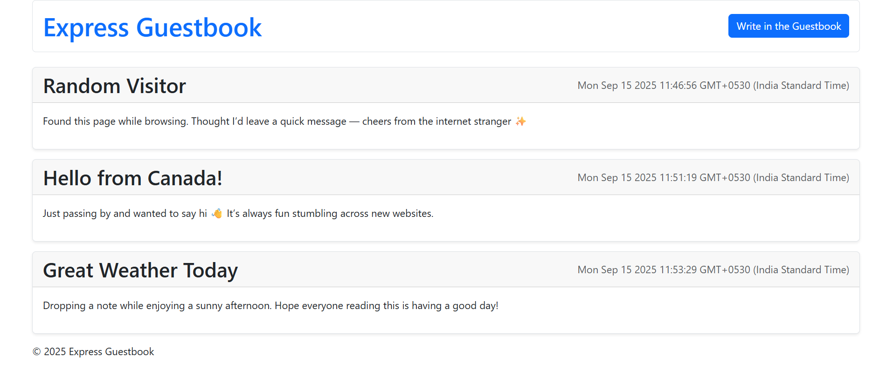
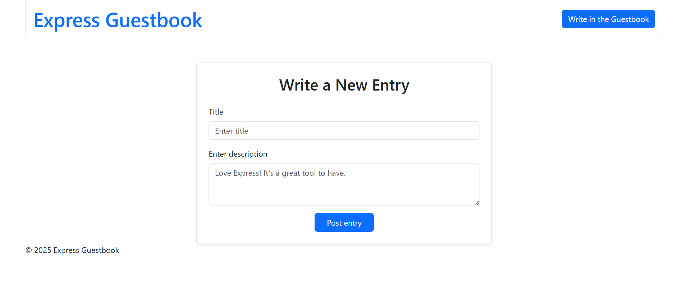
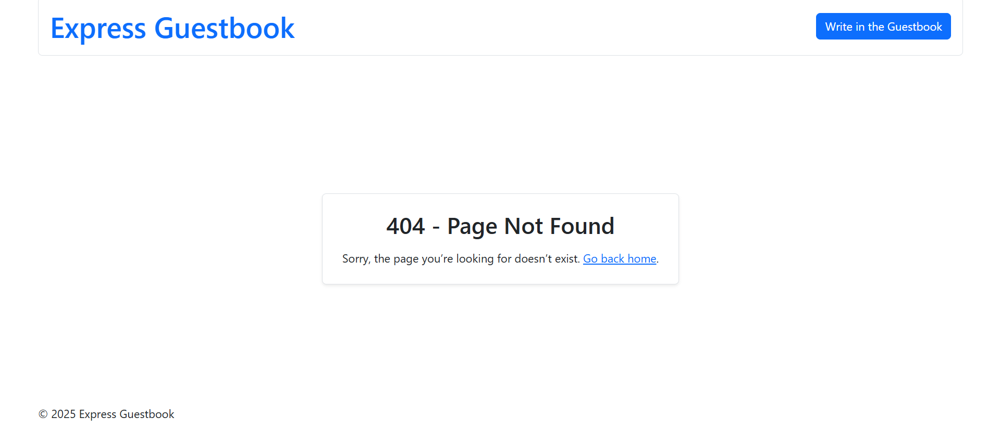

# Express Guestbook

A simple guestbook web app built with **Express.js** and **EJS** templates.  
Users can view guestbook entries, write new ones, and see them displayed on the homepage.

---

## Features

- View all guestbook entries
- Add new entries with a title and description
- Clean UI styled with **Bootstrap 5**
- Handles 404 errors with a custom page
- Server logs with **morgan**

---

## Tech Stack

- [Node.js](https://nodejs.org/)
- [Express.js](https://expressjs.com/)
- [EJS](https://ejs.co/) (templating engine)
- [Bootstrap 5](https://getbootstrap.com/) (frontend styling)
- [Morgan](https://github.com/expressjs/morgan) (logging)

---

## Installation

1. Clone the repository:

```bash
git clone https://github.com/Kashiyapnadh/express-guestbook.git
cd express-guestbook
````

2. Install dependencies:

```bash
npm install
```

3. Start the server:

```bash
node app.js
```

4. Open your browser and go to:

```
http://localhost:7000
```

---

## Project Structure

```
express-guestbook/
├── views/            # EJS templates
│   ├── index.ejs
│   ├── new-entry.ejs
│   ├── 404.ejs
│   ├── header.ejs
│   └── footer.ejs
├── app.js            # Main Express server
├── package.json
└── README.md
```

---

## Screenshots

* **Homepage**
  

* **New Entry Form**
  

* **404 Page**
  

---

## Future Improvements

* Add database support (e.g., MongoDB, SQLite) for persistent storage
* Add authentication for guestbook management
* Improve styling and responsiveness


---

## License

This project is licensed under the MIT License.

